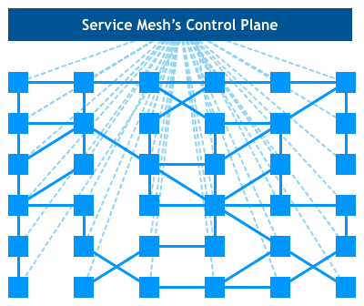
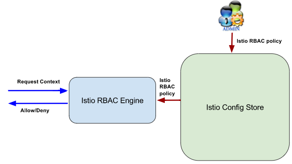
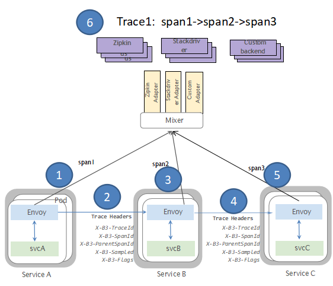
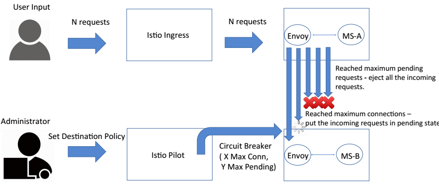

Istio
=====

Before you know what is Istio, you need to know what is **Service Mesh**.

Service Mesh is often used to describe the network of microservices that make up such applications and the interactions between them. As a service mesh grows in size and complexity, it can become harder to understand and manage. Its requirements can include service discovery, load balancing, circuit breaker, failure recovery, retries, metrics, and monitoring, and often more complex operational requirements such as A/B testing, canary releases, rate limiting, access control, and end-to-end authentication.

image::Service Mesh Evolution - Genesis.png[Service Mesh Evolution - Genesis]

image::Service Mesh Evolution - Library.png[Service Mesh Evolution - Library]

History Always Repeat Itself
----------------------------

Istio, is a "service mesh". It aims to unify traffic flow management, access policy enforcement and telemetry data aggregation across microservices into a shared management console, regardless of environment. Istio can discover, connect and monitor services holistically across multiple locations in one place without having to change code.

#### Pilot is for Service Discovery and Config Data to Envoys
- - -

### Mixer
- - -

### Istio provides Role Based Access Control (RBAC)
- - -

### Communication between Envoys and Services
- - -
Traffic is transparently intercepted and proxied between Envoy proxy and Services. Envoy's presence is transparent to Services by using IP Tables.

[width="60%",frame="topbot",options="header"]
|====================================================
| Outbound (To Service)     | Inbound (To Envoy)
| Service authentication    | Service authentication
| Load Balancing            | Authorization
| Retry and circuit breaker | Rate limits
| Fine-grained routing      | Load shedding
| Telemetry                 | Telemetry
| Request Tracing           | Request Tracing
| Fault Injection           | Fault Injection
|====================================================

### Tracing
- - - 

### Canary Release
- - -
image::Canary Release 1.png[Canary Release]

### Circuit Breaker
- - -

### Rate Limits
- - -

### Fault Injection
- - -

Kubernetes and Istio Econsystem
-------------------------------

From improved performance to greatly simplified administration and security, to all with better telemetry data across microservices.

With the cloud services platform you can better control traffic with dynamic route configuration and it is easier to conduct A/B tests and make canary release. Not only you just manage the implementation and deployment of a service but also manage the service itself as it is running.

Today some companies' cloud strategy is just a combination of lift and shift of existing workloads (legacy applications) to the cloud, and writing new cloud application code for new applications, in order to reduce Capital Expenses (CAPEX) and Operating Expenses (OPEX). This approach misses so many benefits of the cloud.

In contrast, Istio combined with Kubernetes, you get a common platform, against with a common service, common APIs and security model for lower operational complexity and faster innovation.

Configure Istio CRD
-------------------

Istio has extended Kubernetes via Custom Resource Definitions (CRD). Deploy the extensions by applying crds.yaml.

[source.console]
----
terrence@igloo /usr/local/istio-1.0.0
𝜆 kubectl apply -f install/kubernetes/helm/istio/templates/crds.yaml -n istio-system
customresourcedefinition.apiextensions.k8s.io/virtualservices.networking.istio.io created
customresourcedefinition.apiextensions.k8s.io/destinationrules.networking.istio.io created
customresourcedefinition.apiextensions.k8s.io/serviceentries.networking.istio.io created
customresourcedefinition.apiextensions.k8s.io/gateways.networking.istio.io created
customresourcedefinition.apiextensions.k8s.io/envoyfilters.networking.istio.io created
customresourcedefinition.apiextensions.k8s.io/policies.authentication.istio.io created
customresourcedefinition.apiextensions.k8s.io/meshpolicies.authentication.istio.io created
customresourcedefinition.apiextensions.k8s.io/httpapispecbindings.config.istio.io created
customresourcedefinition.apiextensions.k8s.io/httpapispecs.config.istio.io created
customresourcedefinition.apiextensions.k8s.io/quotaspecbindings.config.istio.io created
customresourcedefinition.apiextensions.k8s.io/quotaspecs.config.istio.io created
customresourcedefinition.apiextensions.k8s.io/rules.config.istio.io created
customresourcedefinition.apiextensions.k8s.io/attributemanifests.config.istio.io created
customresourcedefinition.apiextensions.k8s.io/bypasses.config.istio.io created
customresourcedefinition.apiextensions.k8s.io/circonuses.config.istio.io created
customresourcedefinition.apiextensions.k8s.io/deniers.config.istio.io created
customresourcedefinition.apiextensions.k8s.io/fluentds.config.istio.io created
customresourcedefinition.apiextensions.k8s.io/kubernetesenvs.config.istio.io created
customresourcedefinition.apiextensions.k8s.io/listcheckers.config.istio.io created
customresourcedefinition.apiextensions.k8s.io/memquotas.config.istio.io created
customresourcedefinition.apiextensions.k8s.io/noops.config.istio.io created
customresourcedefinition.apiextensions.k8s.io/opas.config.istio.io created
customresourcedefinition.apiextensions.k8s.io/prometheuses.config.istio.io created
customresourcedefinition.apiextensions.k8s.io/rbacs.config.istio.io created
customresourcedefinition.apiextensions.k8s.io/redisquotas.config.istio.io created
customresourcedefinition.apiextensions.k8s.io/servicecontrols.config.istio.io created
customresourcedefinition.apiextensions.k8s.io/signalfxs.config.istio.io created
customresourcedefinition.apiextensions.k8s.io/solarwindses.config.istio.io created
customresourcedefinition.apiextensions.k8s.io/stackdrivers.config.istio.io created
customresourcedefinition.apiextensions.k8s.io/statsds.config.istio.io created
customresourcedefinition.apiextensions.k8s.io/stdios.config.istio.io created
customresourcedefinition.apiextensions.k8s.io/apikeys.config.istio.io created
customresourcedefinition.apiextensions.k8s.io/authorizations.config.istio.io created
customresourcedefinition.apiextensions.k8s.io/checknothings.config.istio.io created
customresourcedefinition.apiextensions.k8s.io/kuberneteses.config.istio.io created
customresourcedefinition.apiextensions.k8s.io/listentries.config.istio.io created
customresourcedefinition.apiextensions.k8s.io/logentries.config.istio.io created
customresourcedefinition.apiextensions.k8s.io/edges.config.istio.io created
customresourcedefinition.apiextensions.k8s.io/metrics.config.istio.io created
customresourcedefinition.apiextensions.k8s.io/quotas.config.istio.io created
customresourcedefinition.apiextensions.k8s.io/reportnothings.config.istio.io created
customresourcedefinition.apiextensions.k8s.io/servicecontrolreports.config.istio.io created
customresourcedefinition.apiextensions.k8s.io/tracespans.config.istio.io created
customresourcedefinition.apiextensions.k8s.io/rbacconfigs.rbac.istio.io created
customresourcedefinition.apiextensions.k8s.io/serviceroles.rbac.istio.io created
customresourcedefinition.apiextensions.k8s.io/servicerolebindings.rbac.istio.io created
customresourcedefinition.apiextensions.k8s.io/adapters.config.istio.io created
customresourcedefinition.apiextensions.k8s.io/instances.config.istio.io created
customresourcedefinition.apiextensions.k8s.io/templates.config.istio.io created
customresourcedefinition.apiextensions.k8s.io/handlers.config.istio.io created
----

Install Istio with default mutual TLS authentication
----------------------------------------------------

To Install Istio and enforce mutual TLS authentication by default, use the yaml istio-demo-auth.yaml. This will deploy Pilot, Mixer, Ingress-Controller, and Egress-Controller, and the Istio CA (Certificate Authority):

[source.console]
----
terrence@igloo /usr/local/istio-1.0.0
𝜆 kubectl apply -f install/kubernetes/istio-demo-auth.yaml
namespace/istio-system created
configmap/istio-galley-configuration created
configmap/istio-grafana-custom-resources created
configmap/istio-statsd-prom-bridge created
configmap/prometheus created
configmap/istio-security-custom-resources created
configmap/istio created
configmap/istio-sidecar-injector created
serviceaccount/istio-galley-service-account created
serviceaccount/istio-egressgateway-service-account created
serviceaccount/istio-ingressgateway-service-account created
serviceaccount/istio-grafana-post-install-account created
clusterrole.rbac.authorization.k8s.io/istio-grafana-post-install-istio-system created
clusterrolebinding.rbac.authorization.k8s.io/istio-grafana-post-install-role-binding-istio-system created
job.batch/istio-grafana-post-install created
serviceaccount/istio-mixer-service-account created
serviceaccount/istio-pilot-service-account created
serviceaccount/prometheus created
serviceaccount/istio-cleanup-secrets-service-account created
clusterrole.rbac.authorization.k8s.io/istio-cleanup-secrets-istio-system created
clusterrolebinding.rbac.authorization.k8s.io/istio-cleanup-secrets-istio-system created
job.batch/istio-cleanup-secrets created
serviceaccount/istio-security-post-install-account created
clusterrole.rbac.authorization.k8s.io/istio-security-post-install-istio-system created
clusterrolebinding.rbac.authorization.k8s.io/istio-security-post-install-role-binding-istio-system created
job.batch/istio-security-post-install created
serviceaccount/istio-citadel-service-account created
serviceaccount/istio-sidecar-injector-service-account created
customresourcedefinition.apiextensions.k8s.io/virtualservices.networking.istio.io configured
customresourcedefinition.apiextensions.k8s.io/destinationrules.networking.istio.io configured
customresourcedefinition.apiextensions.k8s.io/serviceentries.networking.istio.io configured
customresourcedefinition.apiextensions.k8s.io/gateways.networking.istio.io configured
customresourcedefinition.apiextensions.k8s.io/envoyfilters.networking.istio.io configured
customresourcedefinition.apiextensions.k8s.io/httpapispecbindings.config.istio.io configured
customresourcedefinition.apiextensions.k8s.io/httpapispecs.config.istio.io configured
customresourcedefinition.apiextensions.k8s.io/quotaspecbindings.config.istio.io configured
customresourcedefinition.apiextensions.k8s.io/quotaspecs.config.istio.io configured
customresourcedefinition.apiextensions.k8s.io/rules.config.istio.io configured
customresourcedefinition.apiextensions.k8s.io/attributemanifests.config.istio.io configured
customresourcedefinition.apiextensions.k8s.io/bypasses.config.istio.io configured
customresourcedefinition.apiextensions.k8s.io/circonuses.config.istio.io configured
customresourcedefinition.apiextensions.k8s.io/deniers.config.istio.io configured
customresourcedefinition.apiextensions.k8s.io/fluentds.config.istio.io configured
customresourcedefinition.apiextensions.k8s.io/kubernetesenvs.config.istio.io configured
customresourcedefinition.apiextensions.k8s.io/listcheckers.config.istio.io configured
customresourcedefinition.apiextensions.k8s.io/memquotas.config.istio.io configured
customresourcedefinition.apiextensions.k8s.io/noops.config.istio.io configured
customresourcedefinition.apiextensions.k8s.io/opas.config.istio.io configured
customresourcedefinition.apiextensions.k8s.io/prometheuses.config.istio.io configured
customresourcedefinition.apiextensions.k8s.io/rbacs.config.istio.io configured
customresourcedefinition.apiextensions.k8s.io/redisquotas.config.istio.io configured
customresourcedefinition.apiextensions.k8s.io/servicecontrols.config.istio.io configured
customresourcedefinition.apiextensions.k8s.io/signalfxs.config.istio.io configured
customresourcedefinition.apiextensions.k8s.io/solarwindses.config.istio.io configured
customresourcedefinition.apiextensions.k8s.io/stackdrivers.config.istio.io configured
customresourcedefinition.apiextensions.k8s.io/statsds.config.istio.io configured
customresourcedefinition.apiextensions.k8s.io/stdios.config.istio.io configured
customresourcedefinition.apiextensions.k8s.io/apikeys.config.istio.io configured
customresourcedefinition.apiextensions.k8s.io/authorizations.config.istio.io configured
customresourcedefinition.apiextensions.k8s.io/checknothings.config.istio.io configured
customresourcedefinition.apiextensions.k8s.io/kuberneteses.config.istio.io configured
customresourcedefinition.apiextensions.k8s.io/listentries.config.istio.io configured
customresourcedefinition.apiextensions.k8s.io/logentries.config.istio.io configured
customresourcedefinition.apiextensions.k8s.io/edges.config.istio.io configured
customresourcedefinition.apiextensions.k8s.io/metrics.config.istio.io configured
customresourcedefinition.apiextensions.k8s.io/quotas.config.istio.io configured
customresourcedefinition.apiextensions.k8s.io/reportnothings.config.istio.io configured
customresourcedefinition.apiextensions.k8s.io/servicecontrolreports.config.istio.io configured
customresourcedefinition.apiextensions.k8s.io/tracespans.config.istio.io configured
customresourcedefinition.apiextensions.k8s.io/rbacconfigs.rbac.istio.io configured
customresourcedefinition.apiextensions.k8s.io/serviceroles.rbac.istio.io configured
customresourcedefinition.apiextensions.k8s.io/servicerolebindings.rbac.istio.io configured
customresourcedefinition.apiextensions.k8s.io/adapters.config.istio.io configured
customresourcedefinition.apiextensions.k8s.io/instances.config.istio.io configured
customresourcedefinition.apiextensions.k8s.io/templates.config.istio.io configured
customresourcedefinition.apiextensions.k8s.io/handlers.config.istio.io configured
clusterrole.rbac.authorization.k8s.io/istio-galley-istio-system created
clusterrole.rbac.authorization.k8s.io/istio-egressgateway-istio-system created
clusterrole.rbac.authorization.k8s.io/istio-ingressgateway-istio-system created
clusterrole.rbac.authorization.k8s.io/istio-mixer-istio-system created
clusterrole.rbac.authorization.k8s.io/istio-pilot-istio-system created
clusterrole.rbac.authorization.k8s.io/prometheus-istio-system created
clusterrole.rbac.authorization.k8s.io/istio-citadel-istio-system created
clusterrole.rbac.authorization.k8s.io/istio-sidecar-injector-istio-system created
clusterrolebinding.rbac.authorization.k8s.io/istio-galley-admin-role-binding-istio-system created
clusterrolebinding.rbac.authorization.k8s.io/istio-egressgateway-istio-system created
clusterrolebinding.rbac.authorization.k8s.io/istio-ingressgateway-istio-system created
clusterrolebinding.rbac.authorization.k8s.io/istio-mixer-admin-role-binding-istio-system created
clusterrolebinding.rbac.authorization.k8s.io/istio-pilot-istio-system created
clusterrolebinding.rbac.authorization.k8s.io/prometheus-istio-system created
clusterrolebinding.rbac.authorization.k8s.io/istio-citadel-istio-system created
clusterrolebinding.rbac.authorization.k8s.io/istio-sidecar-injector-admin-role-binding-istio-system created
service/istio-galley created
service/istio-egressgateway created
service/istio-ingressgateway created
service/grafana created
service/istio-policy created
service/istio-telemetry created
service/istio-statsd-prom-bridge created
deployment.extensions/istio-statsd-prom-bridge created
service/istio-pilot created
service/prometheus created
service/istio-citadel created
service/servicegraph created
service/istio-sidecar-injector created
deployment.extensions/istio-galley created
deployment.extensions/istio-egressgateway created
deployment.extensions/istio-ingressgateway created
deployment.extensions/grafana created
deployment.extensions/istio-policy created
deployment.extensions/istio-telemetry created
deployment.extensions/istio-pilot created
deployment.extensions/prometheus created
deployment.extensions/istio-citadel created
deployment.extensions/servicegraph created
deployment.extensions/istio-sidecar-injector created
deployment.extensions/istio-tracing created
gateway.networking.istio.io/istio-autogenerated-k8s-ingress created
horizontalpodautoscaler.autoscaling/istio-egressgateway created
horizontalpodautoscaler.autoscaling/istio-ingressgateway created
horizontalpodautoscaler.autoscaling/istio-policy created
horizontalpodautoscaler.autoscaling/istio-telemetry created
horizontalpodautoscaler.autoscaling/istio-pilot created
service/jaeger-query created
service/jaeger-collector created
service/jaeger-agent created
service/zipkin created
service/tracing created
mutatingwebhookconfiguration.admissionregistration.k8s.io/istio-sidecar-injector created
attributemanifest.config.istio.io/istioproxy created
attributemanifest.config.istio.io/kubernetes created
stdio.config.istio.io/handler created
logentry.config.istio.io/accesslog created
logentry.config.istio.io/tcpaccesslog created
rule.config.istio.io/stdio created
rule.config.istio.io/stdiotcp created
metric.config.istio.io/requestcount created
metric.config.istio.io/requestduration created
metric.config.istio.io/requestsize created
metric.config.istio.io/responsesize created
metric.config.istio.io/tcpbytesent created
metric.config.istio.io/tcpbytereceived created
prometheus.config.istio.io/handler created
rule.config.istio.io/promhttp created
rule.config.istio.io/promtcp created
kubernetesenv.config.istio.io/handler created
rule.config.istio.io/kubeattrgenrulerule created
rule.config.istio.io/tcpkubeattrgenrulerule created
kubernetes.config.istio.io/attributes created
destinationrule.networking.istio.io/istio-policy created
destinationrule.networking.istio.io/istio-telemetry created
----

List Istio in Pods:

[source.console]
----
terrence@igloo /usr/local/istio-1.0.0
𝜆 kubectl get pods -n istio-system
NAME                                        READY     STATUS              RESTARTS   AGE
grafana-66469c4d95-x2rpc                    1/1       Running             0          7m
istio-citadel-5799b76c66-d87mf              1/1       Running             0          7m
istio-cleanup-secrets-7n7mw                 0/1       Completed           0          7m
istio-egressgateway-657f449d77-vzxg7        1/1       Running             0          7m
istio-galley-5bf4d6b8f7-h6ljg               0/1       ContainerCreating   0          7m
istio-grafana-post-install-q8fjv            0/1       Completed           0          7m
istio-ingressgateway-b55bc6bbb-8jcb4        1/1       Running             0          7m
istio-pilot-c8ff8c54-6bj46                  0/2       Pending             0          7m
istio-policy-566866947b-jpzdx               2/2       Running             0          7m
istio-security-post-install-cw7nn           0/1       Completed           0          7m
istio-sidecar-injector-5b5fcf4df6-rf48b     0/1       ContainerCreating   0          7m
istio-statsd-prom-bridge-7f44bb5ddb-dskfq   1/1       Running             0          7m
istio-telemetry-5966685789-27cf9            0/2       ContainerCreating   0          7m
istio-tracing-ff94688bb-b2cnt               0/1       Running             0          7m
prometheus-84bd4b9796-56m9k                 1/1       Running             0          7m
servicegraph-7875b75b4f-vw4nr               1/1       Running             1          7m
----

List Istio in Services:

[source.console]
----
terrence@igloo /usr/local/istio-1.0.0
𝜆 minikube service list
|--------------|--------------------------|--------------------------------|
|  NAMESPACE   |           NAME           |              URL               |
|--------------|--------------------------|--------------------------------|
| default      | details                  | No node port                   |
| default      | kubernetes               | No node port                   |
| default      | productpage              | No node port                   |
| default      | ratings                  | No node port                   |
| default      | reviews                  | No node port                   |
| istio-system | grafana                  | No node port                   |
| istio-system | istio-citadel            | No node port                   |
| istio-system | istio-egressgateway      | No node port                   |
| istio-system | istio-galley             | No node port                   |
| istio-system | istio-ingressgateway     | http://192.168.99.101:31380    |
|              |                          | http://192.168.99.101:31390    |
|              |                          | http://192.168.99.101:31400    |
|              |                          | http://192.168.99.101:32629    |
|              |                          | http://192.168.99.101:31109    |
|              |                          | http://192.168.99.101:31076    |
|              |                          | http://192.168.99.101:32011    |
| istio-system | istio-pilot              | No node port                   |
| istio-system | istio-policy             | No node port                   |
| istio-system | istio-sidecar-injector   | No node port                   |
| istio-system | istio-statsd-prom-bridge | No node port                   |
| istio-system | istio-telemetry          | No node port                   |
| istio-system | jaeger-agent             | No node port                   |
| istio-system | jaeger-collector         | No node port                   |
| istio-system | jaeger-query             | No node port                   |
| istio-system | prometheus               | No node port                   |
| istio-system | servicegraph             | No node port                   |
| istio-system | tracing                  | No node port                   |
| istio-system | zipkin                   | No node port                   |
| kube-system  | kube-dns                 | No node port                   |
| kube-system  | kubernetes-dashboard     | http://192.168.99.101:30000    |
|--------------|--------------------------|--------------------------------|

terrence@igloo /usr/local/istio-1.0.0
𝜆 kubectl get svc istio-ingressgateway -n istio-system
NAME                   TYPE           CLUSTER-IP       EXTERNAL-IP   PORT(S)                                                                                                     AGE
istio-ingressgateway   LoadBalancer   10.103.203.202   <pending>     80:31380/TCP,443:31390/TCP,31400:31400/TCP,15011:32629/TCP,8060:31109/TCP,15030:31076/TCP,15031:32011/TCP   44m

terrence@igloo /usr/local/istio-1.0.0
𝜆 kubectl -n istio-system get svc grafana prometheus jaeger-query
NAME           TYPE        CLUSTER-IP      EXTERNAL-IP   PORT(S)     AGE
grafana        ClusterIP   10.99.64.215    <none>        3000/TCP    1h
NAME           TYPE        CLUSTER-IP      EXTERNAL-IP   PORT(S)     AGE
prometheus     ClusterIP   10.103.16.254   <none>        9090/TCP    1h
NAME           TYPE        CLUSTER-IP      EXTERNAL-IP   PORT(S)     AGE
jaeger-query   ClusterIP   10.96.253.59    <none>        16686/TCP   1h
----

Access Grafana:

[source.console]
----
𝜆 kubectl -n istio-system get svc grafana
NAME      TYPE        CLUSTER-IP     EXTERNAL-IP   PORT(S)    AGE
grafana   ClusterIP   10.99.64.215   <none>        3000/TCP   2d

𝜆 kubectl -n istio-system describe svc grafana
Name:              grafana
Namespace:         istio-system
Labels:            app=grafana
                   chart=grafana-0.1.0
                   heritage=Tiller
                   release=RELEASE-NAME
Annotations:       kubectl.kubernetes.io/last-applied-configuration={"apiVersion":"v1","kind":"Service","metadata":{"annotations":{},"labels":{"app":"grafana","chart":"grafana-0.1.0","heritage":"Tiller","release":"RELEA...
Selector:          app=grafana
Type:              ClusterIP
IP:                10.99.64.215
Port:              http  3000/TCP
TargetPort:        3000/TCP
Endpoints:         172.17.0.8:3000
Session Affinity:  None
Events:            <none>

𝜆 kubectl -n istio-system get ep grafana
NAME      ENDPOINTS         AGE
grafana   172.17.0.8:3000   2d

𝜆 kubectl -n istio-system port-forward svc/grafana 3000:3000
Forwarding from 127.0.0.1:3000 -> 3000
Forwarding from [::1]:3000 -> 3000
----

Go to Grafana at http://localhost:3000/dashboard/db/istio-mesh-dashboard

Access Prometheus:

[source.console]
----
terrence@igloo /usr/local/istio-1.0.0
𝜆 kubectl -n istio-system port-forward svc/prometheus 9090:9090
Forwarding from 127.0.0.1:9090 -> 9090
Forwarding from [::1]:9090 -> 9090
----

Go to Prometheus at http://localhost:9090/graph

image::Prometheus.png[Prometheus]

Access Jaeger, the tracing:

[source.console]
----
terrence@igloo /usr/local/istio-1.0.0
𝜆 kubectl -n istio-system port-forward svc/jaeger-query 16686:16686
Forwarding from 127.0.0.1:16686 -> 16686
Forwarding from [::1]:16686 -> 16686
----

Go to Jaeger Dashboard at http://localhost:16686

References
----------

- 谈谈微服务架构中的基础设施：Service Mesh与Istio https://zhaohuabing.com/2018/03/29/what-is-service-mesh-and-istio/
- Cloud Native Landscape https://github.com/cncf/landscape