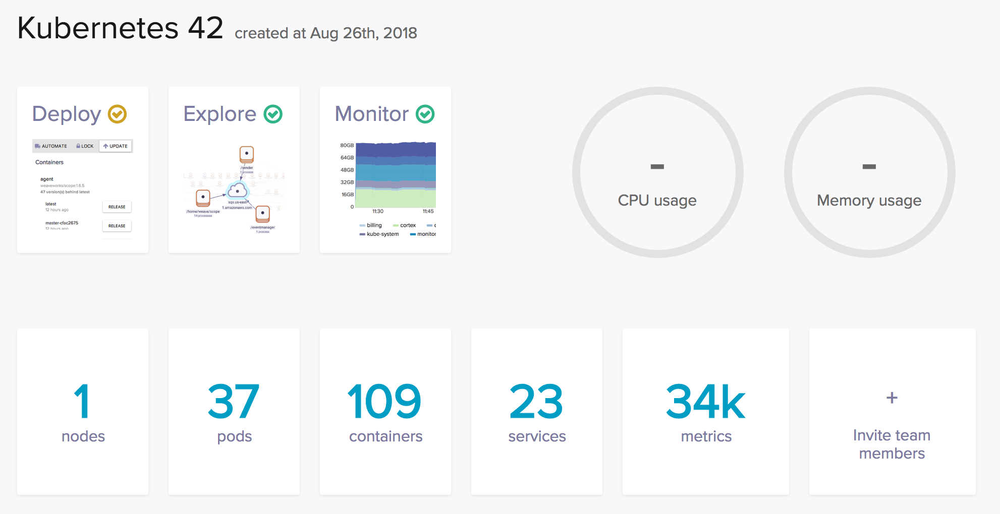
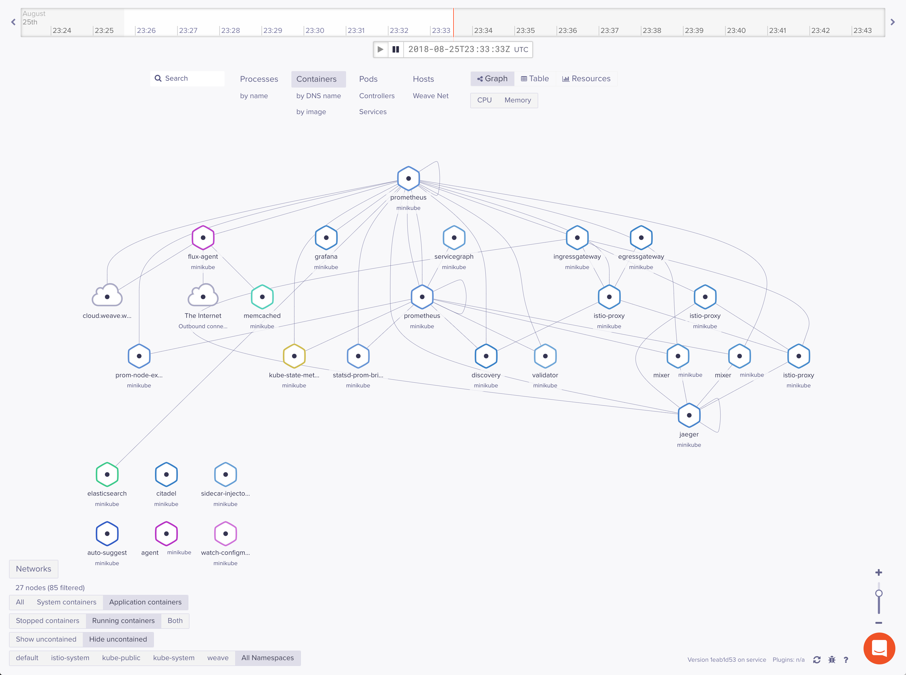

Weave Works
===========

Step by step install Weave Works on Kubernetes platform in Minikube environment.

Install the Weave Cloud Agents:

[source.console]
----
𝜆 curl -Ls https://get.weave.works | sh -s -- --token=<weave token>

Waiting for Weave Cloud agents to connect ... 

Install started

1 of 3 Weave Cloud agents connected!
Waiting for remaining agents

All Weave Cloud agents are connected!
----

Go to Weave Cloud https://cloud.weave.works/

Dashboard in Weave Cloud
------------------------

Containers in Weave Cloud
-------------------------

Uninstall the Weave Cloud agents with: 

[source.console]
----
𝜆 kubectl delete namespace weave
----